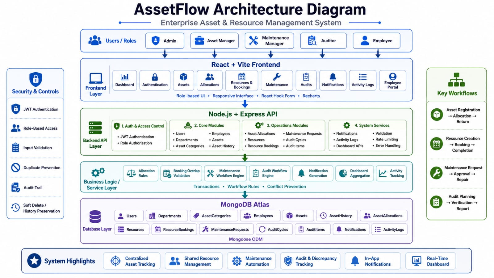

# 🏢 AssetFlow | Enterprise Asset & Resource Management System

AssetFlow is a hackathon-built ERP platform that helps organizations digitally manage physical assets, employees, shared resources, maintenance, audits, allocations, bookings, and operational notifications through one centralized system.

It is designed for organizations such as:

- Colleges and schools
- Offices and companies
- Hospitals
- Factories
- Government departments
- NGOs
- Training centres

---

## 🚨 The Problem

Many organizations still manage assets using:

- Paper registers
- Excel sheets
- WhatsApp messages
- Separate booking forms
- Manual maintenance records
- Physical audit reports

This creates several critical operational problems:

- Assets can be allocated to multiple people accidentally.
- Organizations cannot easily identify who holds an asset.
- Asset returns become overdue without reminders.
- Shared rooms, vehicles, and equipment may be double-booked.
- Maintenance begins without proper approval.
- Missing or damaged assets are discovered very late.
- Audit discrepancies are difficult to track.
- Management lacks real-time visibility.

**The ERP Gap:** Existing ERP platforms are often expensive, complex, and designed for large organizations with accounting and purchasing modules that smaller organizations may not require.

---

## 💡 Our Solution

AssetFlow provides a simple, centralized, and role-based platform for managing the complete lifecycle of organizational assets and shared resources.

The system allows organizations to:

- Register departments and asset categories
- Maintain an Employee Directory
- Register and track assets
- Allocate assets to employees or departments
- Prevent double allocation
- Track return dates and overdue assets
- Manage shared resources
- Prevent overlapping bookings
- Handle maintenance approval workflows
- Conduct physical asset audits
- Record missing and mismatched assets
- Generate in-app notifications
- View real-time dashboard statistics
- Maintain a complete operational Activity Log

---

## 🏗️ System Architecture



---

## 🔥 What Makes AssetFlow Unique?

### One Platform for the Full Asset Journey

Most simple asset systems stop right after asset registration. AssetFlow handles the entire continuous lifecycle chain:

$$\text{Registration} \longrightarrow \text{Allocation} \longrightarrow \text{Usage} \longrightarrow \text{Return} \longrightarrow \text{Maintenance} \longrightarrow \text{Audit} \longrightarrow \text{Retirement} \longrightarrow \text{Disposal}$$

### Allocation and Booking Are Separate

AssetFlow understands that an asset allocation and a resource booking are functionally different:

- A laptop may be allocated to an Employee for months.
- A meeting room may be booked for one hour.
- A vehicle may function as a shared resource.
- A projector may be allocated or booked depending on the use case.

### Database-Level Conflict Prevention

The system does not depend only on frontend validation. It implements robust backend and database protection layers to prevent:

- Double asset allocation
- Duplicate open maintenance requests
- Duplicate audit items
- Overlapping resource bookings
- Duplicate notifications
- Duplicate generated reference numbers

### Maintenance Is Connected to Asset Lifecycle

Maintenance is not stored as an isolated record. When maintenance starts, the asset flips to `Under Maintenance`, and any linked resource is set to `Unavailable`. When maintenance completes, the asset is returned to `Available` or `Retired`, updating the resource availability dynamically.

### Audits Use Historical Snapshots

When an audit cycle starts, asset information is captured as an expected state snapshot. Auditors compare the physical asset against that specific snapshot, allowing the system to flag location, department, employee, or condition mismatches, along with missing and completely unregistered assets.

### Role-Specific Experience

Each user sees only what is relevant to their responsibility across five roles: Admin, Asset Manager, Maintenance Manager, Auditor, and Employee. Both frontend visibility and backend API permissions are strictly enforced.

### Designed for Smaller Organizations

AssetFlow focuses strictly on asset and resource operations without forcing organizations to adopt bloated accounting, invoicing, purchasing, or payroll modules. This keeps configuration lightweight and intuitive.

---

## ⚙️ Detailed Implementation Breakdown

### 🔐 Authentication and Role Management

- Secure JWT authentication with password hashing (`bcryptjs`).
- User activation and deactivation toggles.
- Role-based frontend access controls alongside role-based backend authorization middleware.
- Persistent login sessions.
- Comprehensive user management controlled exclusively by the Admin role.

### 🏢 Organization Setup

- **Department Management:** Full hierarchy mapping.
- **Asset-Category Management:** Grouping by electronics, furniture, vehicles, etc.
- **Employee Directory:** Full profile tracking and employee-to-user account linking.
- **Data Handling:** Global implementations of search, filters, sorting, and pagination across views.

### 📦 Asset Lifecycle Management

Assets are monitored through strict, validated transitional loops:

- `Available` $\rightarrow$ `Reserved` $\rightarrow$ `Allocated` $\rightarrow$ `Available`
- `Available` $\rightarrow$ `Under Maintenance` $\rightarrow$ `Available` or `Retired`
- `Available` $\rightarrow$ `Lost` $\rightarrow$ `Available` or `Retired`
- `Retired` $\rightarrow$ `Disposed`
- Stores complete historical logs of all state updates per asset.

### 🔄 Asset Allocation and Returns

- Allocation options to individual employees or entire departments.
- Strict logic to prevent double allocation.
- Captures purpose definitions and expected return dates.
- Automated detection and highlighting of overdue allocations.
- Logs actual return dates and meticulous condition check-in notes.

### 📅 Shared Resources and Booking

Applies to conference rooms, training halls, vehicles, projectors, equipment, and shared workspaces:

- Resource registration with explicit capacity and location management.
- Live availability tracking.
- Time-slot booking via an interactive frontend calendar view.
- Booking workflows supporting creation, approval, cancellation, and completion.
- Strict mathematical validation preventing overlapping booking slots.
- Personalized "My Bookings" management page for standard employees.

### 🛠️ Maintenance Workflow

The core ticket lifecycle runs through: `Submitted` $\rightarrow$ `Approved` $\rightarrow$ `Technician Assigned` $\rightarrow$ `In Progress` $\rightarrow$ `Completed`.

- Alternative outcomes handle `Submitted` $\rightarrow$ `Rejected` or cancellation branches.
- Allows tracking of issue prioritization and maintenance costs.
- Locks assets from starting maintenance if currently allocated.
- Forces dynamic asset status flips and captures post-repair condition updates.

### 📋 Audit Management

The structural cycle follows: `Create Audit` $\rightarrow$ `Select Scope` $\rightarrow$ `Assign Auditors` $\rightarrow$ `Start Audit` $\rightarrow$ `Generate Items` $\rightarrow$ `Verify` $\rightarrow$ `Record Discrepancies` $\rightarrow$ `Complete Audit` $\rightarrow$ `Report`.

- Scope filtering by specific department or category.
- Automatic item generation utilizing the operational database snapshot.
- Tracks audit completion percentages and delivers structured discrepancy profiles.

### 🔔 Notifications & Activity Logs

- **In-App Alerts:** Covers overdue asset returns, upcoming return dates, booking confirmations/reminders/cancellations, maintenance updates, and audit assignments.
- **Notification Engine Features:** Handles read/unread states, priority tracking, deep-linking navigation to related records, and structural deduplication.
- **Activity Logs:** Immutably writes logs for entries like user logins, asset updates, allocations, bookings, and audit actions to maintain perfect accountability.

### 📊 Dashboard

Fueled by aggregate live queries against MongoDB Atlas:

- **KPI Tracking:** System counts for total, available, allocated, under-maintenance, and lost assets, alongside active employee and resource tracking.
- **Charts Layer:** Visualized representations of asset lifecycles, categories, departments, and condition frequencies via Recharts.
- **Feeds:** Streamed list of recent activity logs and context-aware profiles for logged-in employees.

---

## 👥 User Roles Matrix

### 🛠️ Admin

- Manage Users, Departments, Categories, Employees, and Assets.
- Manage systemic Allocations, Resources, and Bookings.
- Approve Maintenance workflows, initiate/complete Audits, and view the global Dashboard and Activity Logs.

### 📦 Asset Manager

- Manage Categories, Employees, Resources, and Bookings.
- Register, edit, allocate, and process returns for Assets.
- Access centralized Maintenance and Audit information.

### 🔧 Maintenance Manager

- View Assets and review incoming Maintenance Requests.
- Approve/reject requests, assign technicians, track maintenance states, and view structural Resource/Audit parameters.

### 🔍 Auditor

- View assigned Audit Cycles, physically verify items, and record discrepancies or missing states.
- Log newly discovered unregistered findings and view final Audit evaluation reports and system Activity Logs.

### 👥 Employee

- View personal profiles, assigned assets, expected return dates, and custom dashboards.
- Book shared resources, track personal upcoming slots, and submit/monitor asset maintenance tickets.

---

## 💻 Technology Stack

### Frontend

- React, Vite, JavaScript
- Tailwind CSS, React Router, Axios
- React Hook Form, Recharts, Lucide React, date-fns

### Backend

- Node.js, Express.js
- MongoDB Atlas, Mongoose ORM
- JSON Web Token, bcryptjs, express-validator
- Helmet, CORS, Express Rate Limit

---

## 📂 Project Structure

```text
AssetFlow/
├── client/
│   ├── src/
│   │   ├── components/
│   │   ├── context/
│   │   ├── layout/
│   │   ├── pages/
│   │   ├── routes/
│   │   ├── services/
│   │   └── utils/
│   └── package.json
│
├── server/
│   ├── config/
│   ├── controllers/
│   ├── integrations/
│   ├── middleware/
│   ├── models/
│   ├── routes/
│   ├── seed/
│   ├── services/
│   ├── tests/
│   ├── validators/
│   └── package.json
│
└── README.md

```

---

## 🚀 Local Setup & Installation

### Backend Configuration

Create a `server/.env` file and populate:

```env
PORT=5000
NODE_ENV=development
MONGODB_URI=YOUR_MONGODB_ATLAS_CONNECTION_STRING
CLIENT_URL=http://localhost:5174
API_PREFIX=/api

JWT_SECRET=YOUR_LONG_RANDOM_SECRET
JWT_EXPIRES_IN=7d
BCRYPT_SALT_ROUNDS=12

ADMIN_NAME=AssetFlow Admin
ADMIN_EMAIL=admin@assetflow.com
ADMIN_PASSWORD=Admin@123

```

### Frontend Configuration

Create a `client/.env` file and populate:

```env
VITE_API_BASE_URL=http://localhost:5000/api
VITE_USE_MOCK_DATA=false

```

### Running the System

```bash
# Install dependencies
cd server && npm install
cd ../client && npm install

# Run Backend (Terminal 1)
cd server && npm run dev

# Run Frontend (Terminal 2)
cd client && npm run dev

```

### 🗄️ Database Seed Order

Run the seed scripts in the `server` directory sequentially to prep the app for demonstration:

```bash
npm run seed:admin
npm run seed:organization
npm run seed:employees
npm run seed:assets
npm run seed:allocations
npm run seed:resources
npm run seed:maintenance
npm run seed:audits
npm run seed:stage11

```

- **Demo Login:** `admin@assetflow.com` / `Admin@123`

---

## 🤝 Team Contributions & Approach

### Work Breakdown

- **Sriram (Core Platform & Asset Management):** Architecture design, MongoDB Atlas integration, JWT Auth/RBAC, Department/Category configurations, and asset lifecycle state transition tracking.
- **Tejas (Employee, Allocation & Resource Management):** Directory structures, Employee-to-User binding engines, asset allocations/returns logic, allocation checking, and the calendar-based resource overlap prevention matrix.
- **Shubham (Maintenance & Audit Workflows):** Maintenance ticketing pipelines, technician deployment rules, asset-resource syncing, Audit cycle infrastructure, dynamic baseline snapshots, and physical mismatch diagnostic tracking.
- **Mahati (Notifications, Dashboard & UX):** Notification generation and deduplication engines, unified system Activity logs, real-time analytics aggregation, responsive frontend layout routing, and data visualization.

### Hackathon Development Approach

The engineering plan split the project into cleanly separated modules bounded by common API contracts and shared database models, allowing parallel execution across distinct branches:

$$\text{Core Organization Setup} \longrightarrow \text{Assets \& Employees} \longrightarrow \text{Allocations \& Bookings} \longrightarrow \text{Maintenance \& Audits} \longrightarrow \text{Notifications, Dashboard \& Integration}$$

---

## 📈 Impact & Future Enhancements

### Measurable Value

- Reduces organizational asset losses and prevents dual booking overlap constraints.
- Speeds up maintenance turnaround cycles through systematic manager handoffs.
- Protects data integrity by eliminating fragile spreadsheet methodologies.

### Future Scope Considerations

- QR-code/barcode hardware scanning and mobile physical verification portals.
- Cloud storage integration for invoices and asset warranty tracking papers.
- Real-time event sync using WebSockets alongside advanced asset depreciation math.

---

```

```
